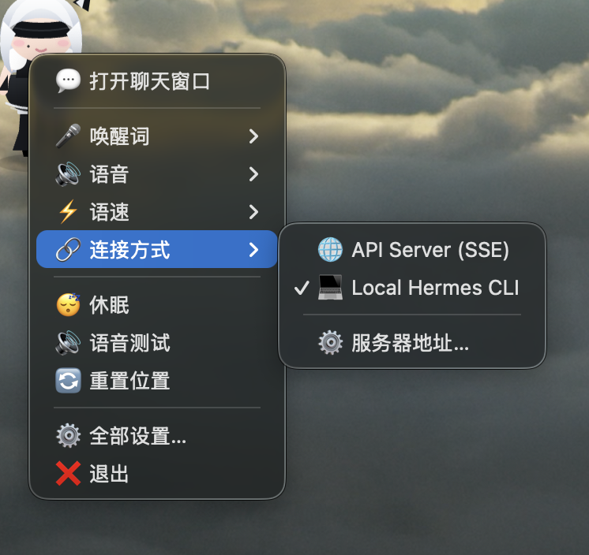
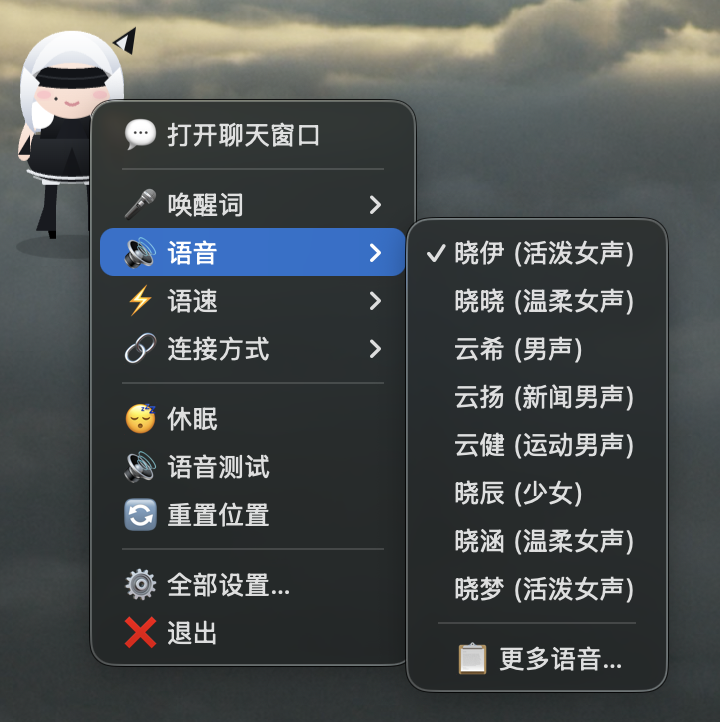
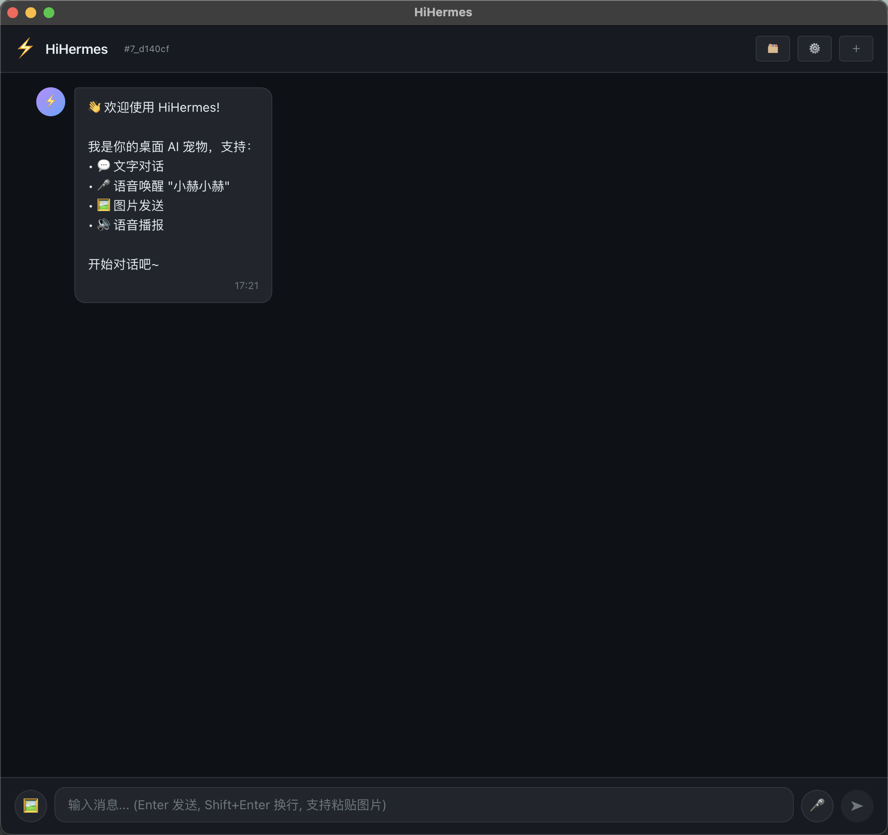

# HiHermes — 二次元桌宠 AI 助手

桌面对话式 AI 桌宠。Q版小人常驻桌面右下角，语音唤醒直接对话，AI 智能回复，语音播报。支持 **macOS** 和 **Windows**。

```
┌──────────────────────────────────────────────────────────┐
│                   Electron App (桌面客户端)                │
│                                                          │
│  ┌─────────┐  ┌──────────┐  ┌────────────────┐          │
│  │ Sherpa  │  │  Edge    │  │  Lottie 桌宠   │          │
│  │ ONNX    │  │  TTS     │  │  透明窗口      │          │
│  │ 唤醒+ASR│  │  语音播报 │  │  右下角常驻    │          │
│  └────┬────┘  └────▲─────┘  └───┬────────────┘          │
│       │            │            │                        │
│       ▼            │            ▼                        │
│  ┌──────────────────────────────┐                        │
│  │     Hermes Bridge            │                        │
│  │  hermes chat -Q -q "..."    │                        │
│  └──────────────┬───────────────┘                        │
│                 │                                        │
│                 ▼                                        │
│  ┌──────────────────────────────────────────────────┐    │
│  │  Hermes Agent + LLM 后端                          │    │
│  │  持久记忆 / 技能 / 工具调用 / 会话管理              │    │
│  └──────────────────────────────────────────────────┘    │
└──────────────────────────────────────────────────────────┘
```

---

## ✨ 功能总览

| 功能 | 实现 | 状态 |
|------|------|------|
| 🎤 语音唤醒 | Sherpa-ONNX 本地唤醒词 | ✅ 已完成 |
| 📝 流式 ASR | Sherpa-ONNX paraformer-zh | ✅ 已完成 |
| 🎨 Q版桌宠 | Electron 透明窗口 + Lottie 动画 | ✅ 已完成 |
| 💬 AI 对话 | Hermes Agent 子进程调用 | ✅ 已完成 |
| 🔊 语音回复 | Edge TTS (zh-CN-XiaoyiNeural) | ✅ 已完成 |
| 🖱️ 交互菜单 | 右键菜单 / 快捷键打开聊天 | ✅ 已完成 |
| 🔤 聊天窗口 | React Chat UI（纯文字） | ✅ 已完成 |
| 🖼️ 图片输入 | 剪贴板粘贴 / 文件上传 | ✅ 已完成 |
| 🧠 会话续传 | 默认恢复最近会话（本地 Hermes） | ✅ 已完成 |
| 🗂️ 会话列表 | 顶部按钮展示倒序会话标题并可切换 | ✅ 已完成 |
| 🧭 顶部按钮提示 | 悬浮显示按钮用途文案 | ✅ 已完成 |
| 🖼️ 文件输出交互 | 回复中的媒体文件支持预览/定位 | ✅ 已完成 |
| ⚙️ 唤醒词/语音自定义 | 配置面板可设 | ✅ 已完成 |

---

## 🏗 完整技术栈

```
模块              选型                      核心优势
─────────────────────────────────────────────────────────
桌面框架          Electron 33               跨平台、透明窗口、系统托盘
前端              React 18 + TypeScript 5   组件化、类型安全
构建              Vite 5 + tsc              HMR 热更新
桌宠动画          Lottie Web                轻量、二次元立绘动效
语音唤醒+ASR      sherpa-onnx-node          离线、流式、唤醒+识别二合一
ASR 模型          paraformer-zh-small       中文最优、<100MB、极低功耗
TTS               Edge TTS (系统原生)        免费、中文自然、低延迟
TTS 语音          zh-CN-XiaoyiNeural        活泼女声，匹配桌宠人设
AI 后端           Hermes Agent CLI          子进程调用、会话保持
通信桥接          本地子进程                 零配置、无网络依赖
```

---

## 🎮 交互流程

### 语音唤醒模式（桌宠常驻右下角）

```
后台监听中...（Sherpa-ONNX 极低功耗）
         │
   喊"小赫"（或自定义唤醒词）
         │
         ▼
   桌宠动效响应（Lottie 播放唤醒动画）
         │
   用户说话 ──→ Sherpa 流式 ASR 实时转文字
         │
         ▼
   文字 → hermes chat -Q -q → AI 回复
         │
         ▼
   回复文本 → Edge TTS 合成语音 → 扬声器播放
         │
   静默 1.2 秒 → 自动休眠，回到监听
```

### 聊天窗口模式（双击桌宠打开）

```
双击右下角桌宠
       │
       ▼
  聊天窗口弹出（React Chat UI）
       │
  文字输入 / 图片粘贴 → Hermes → 文字回复
       │
  ❌ 聊天窗口内不触发语音回复（纯文字交互）
       │
  关闭窗口 → 桌宠回到右下角
```

---

## 📦 获取客户端

### 下载安装包（推荐）

从 [GitHub Releases](https://github.com/lemonguess/HiHermes/releases) 下载最新版本：

| 平台 | 安装包 |
|------|--------|
| 🍎 macOS (Apple Silicon) | `HiHermes-{version}-arm64.dmg` |
| 🍎 macOS (Intel) | `HiHermes-{version}-x64.dmg` |
| 🪟 Windows | `HiHermes-{version}-setup.exe` |

下载后双击安装即可，无需额外配置开发环境。

### 从源码构建

如果你想自己构建或参与开发：

#### 前置要求

| 环境 | 要求 |
|------|------|
| 操作系统 | macOS 12+ / Windows 10+ / Linux |
| Node.js | ≥ 20 |
| Hermes Agent | [可选] 本地已安装的 Hermes Agent CLI |
| 麦克风 | 系统麦克风可用（语音功能） |
| 扬声器 | 音频输出可用 |

#### 1. 克隆 & 安装

```bash
git clone https://github.com/lemonguess/HiHermes.git
cd HiHermes
npm install
```

#### 2. 下载 ASR 模型

```bash
# 下载 paraformer-zh-small 模型（~100MB，自动执行）
npm run postinstall
```

#### 3. 启动开发

```bash
npm run dev
```

#### 4. 打包发布

```bash
npm run build    # 构建
npm run dist     # 生成安装包

# 产物输出到 dist/ 目录
# macOS:  .dmg
# Windows: .exe (NSIS 安装器)
```

---

## 📁 项目结构

```
HiHermes/
├── package.json
├── electron-builder.yml      # Electron 打包配置（macOS + Windows）
├── vite.config.ts
├── index.html                # 桌宠窗口 HTML（透明+Lottie）
├── chat.html                 # 聊天窗口 HTML（React Chat UI）
├── model/                    # Sherpa-ONNX 模型文件
│   ├── paraformer-zh-small.onnx
│   └── tokens.txt
├── src/
│   ├── main/                 # Electron 主进程
│   │   ├── index.ts           # 窗口管理（桌宠窗口 + 聊天窗口）
│   │   ├── hermes-bridge.ts   # Hermes 子进程桥接
│   │   ├── sherpa-engine.ts   # Sherpa-ONNX 唤醒+ASR 引擎
│   │   ├── tts-engine.ts      # Edge TTS 语音合成
│   │   ├── tray.ts            # 系统托盘
│   │   └── preload.ts
│   ├── renderer/              # 渲染进程
│   │   ├── pet/               # 桌宠页面
│   │   │   ├── PetApp.tsx      # 桌宠主组件
│   │   │   └── LottiePet.tsx   # Lottie 动画组件
│   │   ├── chat/              # 聊天窗口页面
│   │   │   ├── ChatApp.tsx
│   │   │   ├── ChatWindow.tsx
│   │   │   ├── MessageBubble.tsx
│   │   │   ├── InputBar.tsx
│   │   │   └── VoiceButton.tsx
│   │   ├── hooks/
│   │   │   ├── useHermes.ts    # Hermes 通信 hook
│   │   │   ├── useVoice.ts     # 语音录制 hook
│   │   │   └── useWakeWord.ts  # 唤醒词状态 hook
│   │   └── styles/
│   └── shared/
│       └── types.ts
├── assets/
│   ├── pet-*.png              # 当前桌宠精灵帧
│   ├── pet-chibi-shortskirt.svg # 新版短裙长腿桌宠形象
│   └── screenshots/           # README 使用截图（示例占位）
│       └── .gitkeep
└── public/
    └── mock-api.js            # Web 预览 mock
```

---

## 🔧 核心技术细节

### Sherpa-ONNX 唤醒+ASR 配置

```typescript
// src/main/sherpa-engine.ts
const config = {
  // 流式 ASR 模型
  recognizer: {
    modelType: "paraformer-zh",
    modelPath: path.join(__dirname, "../model/paraformer-zh-small.onnx"),
    tokensPath: path.join(__dirname, "../model/tokens.txt"),
    numThreads: 2,        // CPU 低占用
    useGPU: false,
  },
  // 唤醒词
  wakeWord: {
    words: ["小赫", "AI助手"],  // 可自定义
    threshold: 0.5,              // 灵敏度
  },
  // 静默检测
  silenceTimeout: 1.2,    // 1.2 秒静默后休眠
  streaming: true,          // 流式识别（边说边出字）
};
```

### Edge TTS 语音合成

```typescript
// src/main/tts-engine.ts
// Edge TTS 支持流式输出，逐句合成播放
// 语音: zh-CN-XiaoyiNeural (活泼女声)

import { exec } from 'child_process';

async function speak(text: string): Promise<void> {
  return new Promise((resolve) => {
    const proc = exec(
      `edge-tts --voice zh-CN-XiaoyiNeural --text "${text}" --write-media -`,
      (err) => { if (err) console.error(err); resolve(); }
    );
    // 流式写入扬声器
    proc.stdout?.pipe(createAudioOutput());
  });
}
```

### Hermes 桥接

```typescript
// src/main/hermes-bridge.ts
// 通过本地子进程调用 Hermes Agent
import { exec } from 'child_process';

function callHermes(message: string, sessionId?: string): Promise<string> {
  const escaped = message.replace(/"/g, '\\"');
  const cmd = sessionId
    ? `hermes --resume ${sessionId} chat -Q -q "${escaped}"`
    : `hermes chat -Q -q "${escaped}"`;

  return new Promise((resolve) => {
    exec(cmd, { timeout: 120000 }, (err, stdout) => {
      // 跳过首行 session_id
      const lines = stdout.trim().split('\n');
      resolve(lines.slice(1).join('\n').trim());
    });
  });
}
```

---

## 🔄 流式 TTS 方案

**核心问题：Hermes CLI 不支持 token 级流式输出。**

### 采用的方案：句子级流式 TTS

```
Hermes 返回完整回复
        │
        ▼
按标点拆分为句子数组
  ["主人好呀！", "我马上帮你查...", "查到了哦~"]
        │
        ▼
逐句送入 Edge TTS（边合成边播放）
  句1 播放中 → 句2 合成中 → 句3 排队中
```

### 为什么不用真正的 streaming？

| 方案 | 可行性 | 原因 |
|------|--------|------|
| Hermes CLI `--stream` | ❌ | Hermes 无此参数 |
| LLM API 直调 `stream:true` | ✅ | 可直接调 API 拿 token 流 |
| Hermes ACP 模式 | ❌ | ACP 是编辑器协议，非通用 |
| 句子级 TTS 流式 | ✅ | **当前采用方案** |

### 进阶方案（可选）：绕过 Hermes CLI，直调 LLM API

如果需要真正的 token 级流式 TTS，可直接在 Electron 中调用 API：

```typescript
// 流式调用，token 边出边 TTS
const response = await fetch('https://api.deepseek.com/v1/chat/completions', {
  method: 'POST',
  headers: { 'Authorization': `Bearer ${apiKey}` },
  body: JSON.stringify({
    model: 'deepseek-chat',
    messages: [...],
    stream: true,  // 🔥 关键
  }),
});

// SSE 逐 token 读取，累计到完整句子后送入 TTS
```

**代价：** 绕过 Hermes 意味着失去工具调用、记忆、技能等能力。因此推荐**句子级流式**作为默认方案。

---

## 🎨 桌宠动画说明

### Lottie 动画文件

| 文件 | 触发条件 | 说明 |
|------|----------|------|
| `pet-idle.json` | 默认待机 | 呼吸/眨眼循环 |
| `pet-wake.json` | 唤醒词命中 | 弹跳/发光/转圈 |
| `pet-speak.json` | TTS 播放中 | 嘴巴张合 |
| `pet-sleep.json` | 静默超时 | 趴下/zzZ |

### 互动行为

| 操作 | 效果 |
|------|------|
| 语音喊"小赫" | 唤醒 + 流式 ASR 开始 |
| 双击桌宠 | 打开聊天窗口 |
| 拖拽桌宠 | 移动到屏幕任意位置 |
| 右键桌宠 | 设置菜单（唤醒词/TTS/关于） |
| 静默 1.2s | 自动休眠回待机 |

---

## 🖼️ 使用









---

## 📝 待办

- [x] Electron + React + TS 项目脚手架
- [x] Hermes CLI 桥接（one-shot 模式）
- [x] 文字聊天窗口
- [x] 图片粘贴上传
- [ ] Sherpa-ONNX Node 集成（唤醒词+流式ASR）
- [ ] Edge TTS 语音回复
- [ ] 桌宠透明窗口 + Lottie 动画
- [ ] 双击桌宠打开聊天窗口
- [ ] 唤醒词自定义设置面板
- [ ] 句子级流式 TTS
- [ ] 系统托盘 + 开机自启
- [ ] macOS / Windows 安装包打包
- [ ] 多唤醒词 + 热词切换
